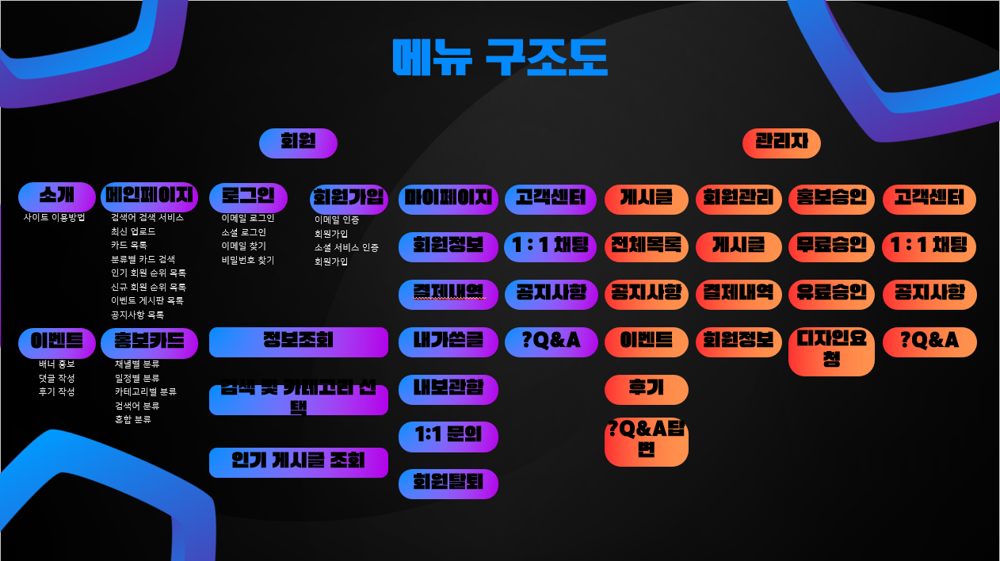
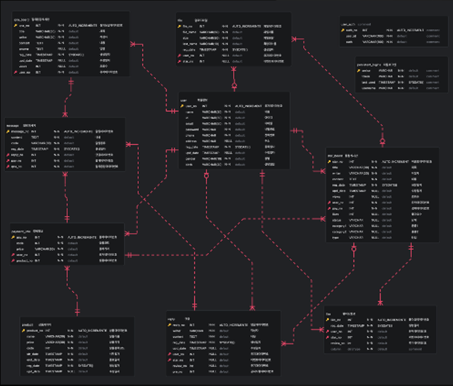

# 당스만_STARMAKERS_REACT
개인 프로모션 대행 서비스 _ React 적용

## 기술 스택

## 소개

Spring Boot에서 Thymeleaf를 사용하여 페이지와 데이터 처리가 분리되어 있던 서버의 getMemberList 메소드를, 프론트엔드에서 페이지 라우팅을 담당하고 서버는 RESTful 방식으로 데이터 처리만 수행하도록 변경했습니다.

## 당스만 프로젝트
### 1. 프로젝트 개요
  - 프로젝트 소개
  - 기획 의도
### 2. 프로젝트 구조
  - 메뉴 구조도
### 3. 프로젝트 진행과정
  - 수행 절차 및 방법
  - 프로젝트 수행 결과
### 4. 한계점 및 개선점

# 1. 프로젝트 개요
## 1-1. 프로젝트 소개
- 크레에이터들은 오늘도 미디어산업에 뛰어듬.
- 하지만 대부분 알려지지 않고 사라짐.
- 꿈을 가진 크리에이터들의 도전적인 컨텐츠를 소개
- 새로운 컨텐츠를 찾는 이들과의 접점을 마련
## 1-2. 기획 의도
- 통합 프로모션
  - 여러 플랫폼의 통합
  - 다양한 콘텐츠를 쉽게 더 많은 사람들에게 노출
  - 교류를 위한 다양한 기능, 추가홍보, 활발한 커뮤니티

- 새로운 컨텐츠의 발굴
  - 새롭고 다양한 크리에이터들 발굴하고 응원할 수 있는 플랫폼
  - 자신만의 홍보 전략을 선택, 더욱 눈에 띄는 옵션을 제공
  - 독창적인 콘텐츠를 제작하고 성공할 수 있는 환경물 조성

## 2. 프로젝트 구조

<h3>ℹ️메뉴 구조도</h3>

  

## 3. 프로젝트 진행 과정

## 3-1. 수행 절차 및 방법

<h3>ℹ️수행 절차 및 방법</h3>

  

## 3-2. 수행 절차 및 방법

<h3>ℹ️프로젝트 수행 결과</h3>

  

## 요구사항 정의서

<h3>ℹ️요구사항 정의서</h3>

  
  
  

## 기능 정의서

<h3>ℹ️기능 정의서</h3>

  
  
  

## ERD

<h3>ℹ️ERD</h3>

  

## 테이블 정의서

<h3>ℹ️테이블 정의서</h3>

  
  
  
  

## 4. 한계점 및 개선점

- 이전 프로젝트의 한계점
    - 컨텐츠를 소비하는 사용자와 생산하는 크리에이터간의 좀 더 강한 관계를 맺어줄 수 있는 기능개발에 미흡한점이 있다고 생각했습니다.
- 리액트 전환하며 개선점 및 새로 확장한 기능
    - 포인트제도를 만들어 사이트를 좀 더 다양하게 즐길수 있는 방법을 열었고 소비층인 사용자가 컨텐츠를 생산해주는 크리에이터회원에게 직접 후원을 해 줄 수 있는 기능을 개선했습니다.
